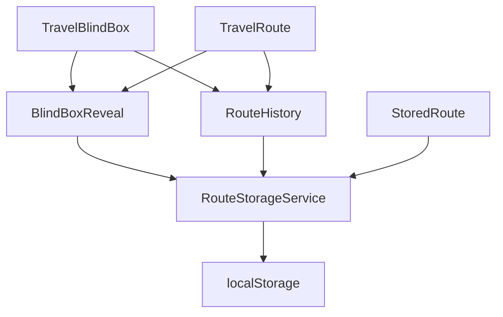
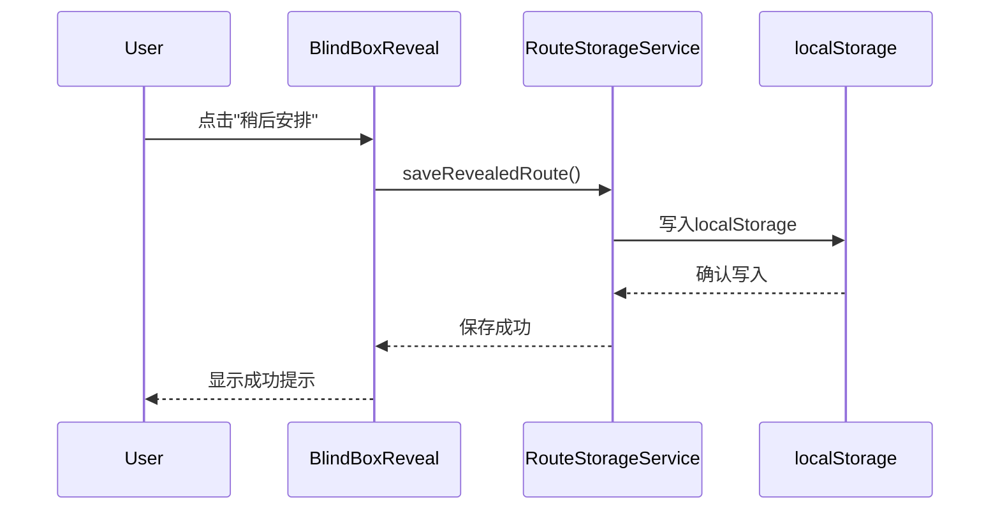
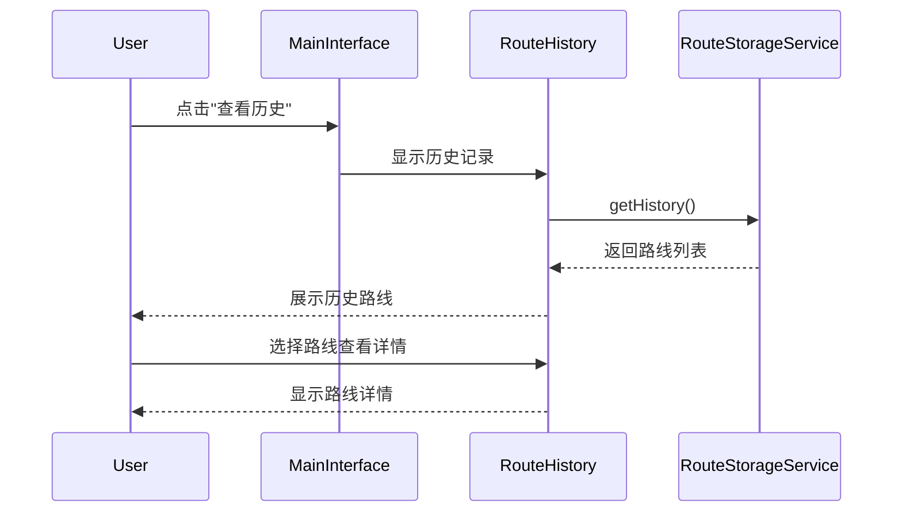

# 设计决策说明：修复盲盒揭晓交互功能

## 设计概览

**变更ID**: `fix-blindbox-reveal-interactions`  
**设计版本**: v1.0  
**创建日期**: 2025-12-27

## 设计原则与约束

### 核心设计原则

1. **最小化变更原则**: 在不破坏现有架构的前提下进行功能增强
2. **用户体验优先**: 确保新功能直观易用，符合用户期望
3. **数据本地化**: 使用localStorage避免复杂的后端依赖
4. **渐进式增强**: 新功能作为增量添加，不影响现有流程

### 技术约束

- **浏览器兼容性**: 现代浏览器（支持localStorage和ES2020+）
- **存储限制**: localStorage容量限制（通常5-10MB）
- **数据类型**: 仅支持可序列化的JavaScript对象
- **网络依赖**: 无需网络连接，纯客户端实现

## 架构设计

### 服务层架构

```
┌─────────────────────────────────────┐
│           UI 组件层                  │
├─────────────────────────────────────┤
│     RouteStorageService (新增)       │
├─────────────────────────────────────┤
│        localStorage API              │
└─────────────────────────────────────┘
```

### 组件关系图



## 数据设计

### 存储结构设计

#### 1. 路线存储接口

```typescript
interface StoredRoute extends TravelRoute {
  id: string                    // 唯一标识符
  savedAt: string              // 保存时间（ISO字符串）
  status: 'revealed' | 'scheduled'  // 路线状态
  userNotes?: string           // 用户备注（可选）
  generationParams?: TravelParams  // 生成参数（用于重新生成）
}
```

#### 2. 存储键名设计

```typescript
const STORAGE_KEYS = {
  REVEALED_ROUTES: 'travelblindbox_revealed_routes',
  SCHEDULED_ROUTES: 'travelblindbox_scheduled_routes',
  USER_PREFERENCES: 'travelblindbox_user_preferences'
} as const
```

#### 3. 数据版本控制

```typescript
interface StorageSchema {
  version: string              // 数据结构版本号
  routes: StoredRoute[]        // 路线数据数组
  lastUpdated: string         // 最后更新时间
}
```

## 功能设计

### 1. RouteStorageService 设计

#### 核心方法设计

```typescript
class RouteStorageService {
  // 保存已揭晓的路线
  saveRevealedRoute(route: TravelRoute, params?: TravelParams): void
  
  // 标记路线为稍后安排
  scheduleRoute(routeId: string): void
  
  // 获取历史记录
  getHistory(): StoredRoute[]
  
  // 获取稍后安排
  getScheduled(): StoredRoute[]
  
  // 删除路线
  deleteRoute(routeId: string): void
  
  // 清理过期数据
  cleanup(maxAgeDays: number = 30): void
  
  // 导出数据
  exportData(): string
  
  // 导入数据
  importData(data: string): boolean
}
```

#### 错误处理策略

- **存储失败**: 使用try-catch包装localStorage操作
- **数据格式错误**: 验证数据完整性，提供回退机制
- **容量超限**: 实施LRU策略，自动清理旧数据
- **并发访问**: 使用简单的锁机制防止数据竞争

### 2. 用户界面设计

#### 历史记录查看界面

```typescript
interface RouteHistoryProps {
  onRouteSelect: (route: StoredRoute) => void
  onClose: () => void
  showScheduledOnly?: boolean
}
```

**布局设计**:
- 顶部：标题和搜索/筛选控件
- 中部：路线卡片列表（支持分页）
- 底部：批量操作按钮（删除、导出等）

#### 增强的盲盒揭晓界面

**新增功能区域**:
- "查看历史"按钮（顶部导航栏）
- 增强的"稍后安排"按钮（带状态反馈）
- 保存状态提示（成功/失败消息）

### 3. 交互流程设计

#### 路线保存流程



#### 历史查看流程



## 技术实现细节

### 1. 数据序列化策略

```typescript
// 自定义序列化函数
function serializeRoute(route: TravelRoute): StoredRoute {
  return {
    ...route,
    id: generateRouteId(),
    savedAt: new Date().toISOString(),
    status: 'revealed'
  }
}

// 反序列化函数
function deserializeRoute(stored: any): TravelRoute | null {
  try {
    // 验证必要字段
    if (!stored.id || !stored.title || !stored.description) {
      return null
    }
    
    // 移除存储专用字段
    const { id, savedAt, status, userNotes, ...routeData } = stored
    return routeData as TravelRoute
  } catch (error) {
    console.error('Failed to deserialize route:', error)
    return null
  }
}
```

### 2. 性能优化策略

#### 内存管理
- **惰性加载**: 历史记录按需加载，避免一次性加载大量数据
- **虚拟滚动**: 大列表使用虚拟滚动技术
- **缓存策略**: 内存缓存常用数据，减少localStorage访问

#### 存储优化
- **数据压缩**: 使用LZ-string压缩存储数据
- **分片存储**: 大量数据分片存储，避免单条记录过大
- **索引管理**: 建立内存索引加速查询

### 3. 安全性考虑

#### 数据验证
```typescript
function validateStoredRoute(data: any): data is StoredRoute {
  return (
    typeof data === 'object' &&
    typeof data.id === 'string' &&
    typeof data.title === 'string' &&
    typeof data.description === 'string' &&
    Array.isArray(data.highlights) &&
    Array.isArray(data.itinerary) &&
    ['revealed', 'scheduled'].includes(data.status)
  )
}
```

#### XSS防护
- 对用户输入进行HTML转义
- 使用textContent而非innerHTML渲染用户内容
- 实施内容安全策略（CSP）

## 兼容性设计

### 向后兼容性
- **渐进增强**: 新功能不影响现有用户流程
- **数据迁移**: 自动迁移旧格式数据
- **功能降级**: 在不支持localStorage的环境中优雅降级

### 浏览器兼容性
- **现代浏览器**: Chrome 60+, Firefox 55+, Safari 12+
- **移动端**: iOS Safari 12+, Chrome Mobile 60+
- **降级方案**: 不支持localStorage时提供会话存储作为备选

## 测试策略

### 单元测试
- RouteStorageService的所有方法
- 数据序列化/反序列化函数
- 数据验证函数

### 集成测试
- 完整的保存-查看-删除流程
- localStorage容量限制处理
- 错误场景处理

### 用户验收测试
- 盲盒揭晓流程完整性
- 历史记录功能可用性
- "稍后安排"功能正确性

## 部署和监控

### 发布策略
- **特性开关**: 新功能通过配置开关控制
- **灰度发布**: 逐步向用户群体开放新功能
- **回滚机制**: 出现问题时快速回滚到之前版本

### 监控指标
- **功能使用率**: 历史查看功能的使用频率
- **保存成功率**: "稍后安排"功能的保存成功率
- **性能指标**: 数据加载时间和界面响应时间
- **错误率**: localStorage操作失败率

---

**设计文档版本**: v1.0  
**最后更新**: 2025-12-27  
**设计负责人**: 架构师